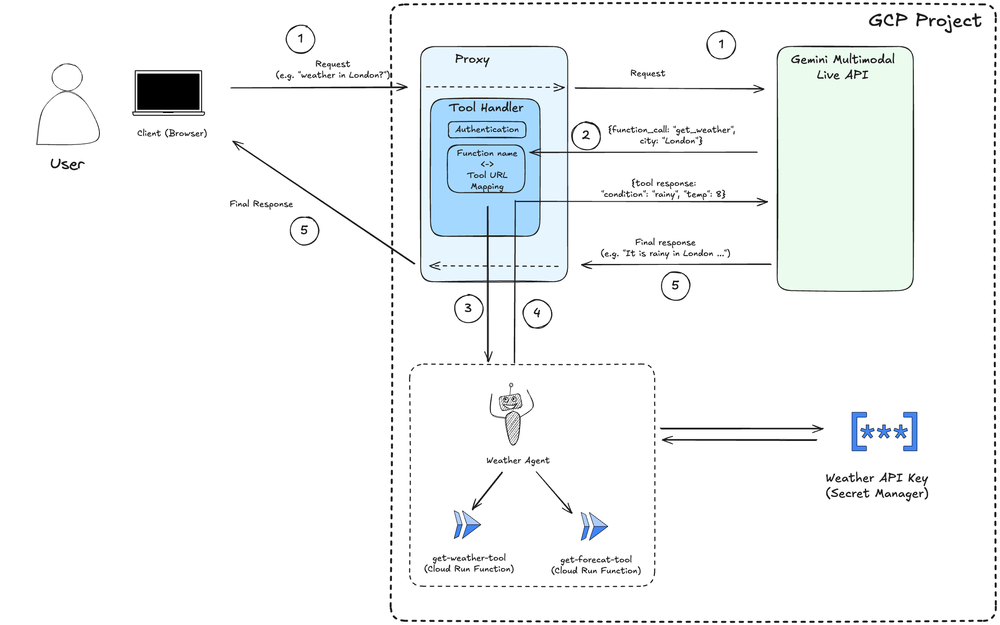

# Project Livewire 

**Talk to AI like never before! Project Livewire is a real-time, multimodal chat application showcasing the power of Google's Gemini 2.0 Flash (experimental) Live API.**

Think "Star Trek computer" interaction – speak naturally, show your webcam, share your screen, and get instant, streamed audio responses. Livewire brings this futuristic experience to your devices today.

This project builds upon the concepts from the [Gemini Multimodal Live API Developer Guide](https://github.com/heiko-hotz/gemini-multimodal-live-dev-guide) with a focus on a more production-ready setup and enhanced features.

## ✨ Key Features

*   **🎤 Real-time Voice:** Natural, low-latency voice conversations.
*   **👁️ Multimodal Input:** Combines voice, text, webcam video, and screen sharing.
*   **🔊 Streamed Audio Output:** Hear responses instantly as they are generated.
*   **↩️ Interruptible:** Talk over the AI, just like a real conversation.
*   **🛠️ Optional Tools:** The server can call external tools via Cloud Functions (none enabled by default).
*   **📱 Responsive UI:** Includes both a development interface and a mobile-optimized view.
*   **☁️ Cloud Ready:** Designed for easy deployment to Google Cloud Run.

<!-- Optional: Add a GIF/Video Demo Here -->
<!--  -->

## 🚀 Getting Started

Choose your path: run locally for development or deploy straight to the cloud.

**Prerequisites:**

*   Python 3.8+
*   API Keys:
    *   Google Gemini API Key ([Get one here](https://makersuite.google.com/app/apikey))
*   Google Cloud SDK (`gcloud` CLI) (Recommended for cloud deployment & secrets)
*   Deployed Tool Functions (See [Cloud Functions Guide](./cloud-functions/README.md))

---

### 1. 💻 Run Locally

These are the basic steps. For more detailed instructions, see the **[Local Setup Guide](./docs/local_setup.md)**.

1.  **Clone the repo:**
    ```bash
    git clone https://github.com/heiko-hotz/project-livewire.git
    cd project-livewire
    ```

2.  **Configure Backend:**
    ```bash
    cd server
    cp .env.example .env
    nano .env # Edit with your API keys & Function URLs
    # --> See server/README.md for detailed .env options <--
    ```
    *   *Minimum required in `.env`:* `GOOGLE_API_KEY` (if not using Vertex/ADC).

3.  **Run Backend:**
    ```bash
    pip install -r requirements.txt
    python server.py
    # Backend runs on localhost:8081
    ```

4.  **Run Frontend (in a *new* terminal):**
    ```bash
    cd ../client
    python -m http.server 8000
    # Frontend served on localhost:8000
    ```

5.  **Access:**
    *   Dev UI: `http://localhost:8000/index.html`
    *   Mobile UI: `http://localhost:8000/mobile.html`

---

### 2. Option A: ☁️ Deploy to Google Cloud Run

This uses Cloud Build to containerize and deploy the client & server. For more detailed step-by-step instructions, refer to the **[Cloud Deployment Guide](./docs/cloud_deployment.md)**.

1.  **Setup Google Cloud:**
    *   Set your project: `gcloud config set project YOUR_PROJECT_ID`
    *   Enable APIs (Run, Cloud Build, Secret Manager, etc.).
    *   Create Secrets (`GOOGLE_API_KEY`) in Secret Manager.
    *   Create a Service Account (`livewire-backend`) with Secret Accessor role.
    *   Deploy Tool Functions (See [Cloud Functions Guide](./cloud-functions/README.md)).

2.  **Deploy Backend:**
    ```bash
    # Make sure PROJECT_ID is set in your environment or cloudbuild.yaml
    gcloud builds submit --config server/cloudbuild.yaml
    ```

3.  **Get Backend URL:** Note the URL output by the previous command (or use `gcloud run services describe livewire-backend...`). Let's call it `YOUR_BACKEND_URL`.

4.  **Deploy Frontend:**
    ```bash
    # Pass the backend URL to the frontend build
    gcloud builds submit --config client/cloudbuild.yaml --substitutions=_BACKEND_URL=YOUR_BACKEND_URL
    ```
    *(Note: Ensure client code uses the provided `_BACKEND_URL` instead of localhost. See `docs/cloud_deployment.md` for details).*

5.  **Access:** Get the frontend service URL (`gcloud run services describe livewire-ui...`) and open it in your browser.

---

### 2. Option B: ⚡ Quick Prototype Deploy (Cloud Run + inline API key)

Fastest path to a shareable prototype. Deploy backend and frontend to Cloud Run, and pass the backend URL to the client via a `?ws=` query param. No Secret Manager or service accounts required.

Summary
- Backend: Cloud Run service `livewire-backend` (port 8081) with env `GOOGLE_API_KEY`.
- Frontend: Cloud Run service `livewire-ui` (nginx static hosting).
- Client: Accepts `?ws=` (normalizes https→wss, adds scheme if missing).

Steps
1) Prereqs
     - gcloud installed and authenticated
     - Project and region set:
         ```bash
         gcloud config set project YOUR_PROJECT_ID
         gcloud config set run/region us-central1
         gcloud services enable run.googleapis.com cloudbuild.googleapis.com containerregistry.googleapis.com
         ```

2) Backend (build + deploy)
     ```bash
     gcloud builds submit --tag gcr.io/$(gcloud config get-value project)/livewire-backend server
     gcloud run deploy livewire-backend \
         --image gcr.io/$(gcloud config get-value project)/livewire-backend \
         --platform managed \
         --region $(gcloud config get-value run/region) \
         --allow-unauthenticated \
         --port 8081 \
         --set-env-vars LOG_LEVEL=INFO,GOOGLE_API_KEY=YOUR_GEMINI_API_KEY
     export BACKEND_URL=$(gcloud run services describe livewire-backend --platform managed --region $(gcloud config get-value run/region) --format 'value(status.url)')
     export WSS_BACKEND_URL=$(echo ${BACKEND_URL} | sed 's|https://|wss://|')
     ```

3) Frontend (build + deploy)
     ```bash
     gcloud builds submit --config client/cloudbuild.yaml
     # If needed, allow public access:
     gcloud run services add-iam-policy-binding livewire-ui \
         --region $(gcloud config get-value run/region) \
         --member=allUsers \
         --role=roles/run.invoker
     export FRONTEND_URL=$(gcloud run services describe livewire-ui --platform managed --region $(gcloud config get-value run/region) --format 'value(status.url)')
     ```

4) Share the link
- Mobile/default UI: `${FRONTEND_URL}/?ws=${WSS_BACKEND_URL}`
- Desktop UI: `${FRONTEND_URL}/index.html?ws=${WSS_BACKEND_URL}`

Pros
- Very fast; minimal setup.
- Frontend doesn’t need rebuilds when backend URL changes—just update `?ws=`.

Cons
- API key stored as a Cloud Run env var (less secure than Secret Manager).
- Not intended for production; prefer Option B for security and IAM.
- Requires including `?ws=` in the URL (defaults to localhost without it).

How to update this prototype
- Backend code changes:
    ```bash
    gcloud builds submit --tag gcr.io/$(gcloud config get-value project)/livewire-backend server
    gcloud run deploy livewire-backend \
        --image gcr.io/$(gcloud config get-value project)/livewire-backend \
        --region $(gcloud config get-value run/region) \
        --platform managed \
        --allow-unauthenticated \
        --port 8081 \
        --set-env-vars LOG_LEVEL=INFO,GOOGLE_API_KEY=YOUR_GEMINI_API_KEY
    ```
    The service URL is stable; existing `?ws=` links keep working.

- Frontend code/assets changes:
    ```bash
    gcloud builds submit --config client/cloudbuild.yaml
    ```
    The frontend URL is stable; re-use the same link.

Upgrade path
- When ready, move to Option B (Secret Manager + service account) for better security. See `docs/cloud_deployment.md`.

## 🏗️ Architecture Overview

Project Livewire consists of:

1.  **Client (`client/`):** Vanilla JS frontend handling UI, media capture, and WebSocket connection. ([Details](./client/README.md))
2.  **Server (`server/`):** Python WebSocket server proxying to Gemini, managing sessions, and calling tools. ([Details](./server/README.md))
3.  **Tools (`cloud-functions/`):** Google Cloud Functions providing external capabilities (weather, calendar). ([Details](./cloud-functions/README.md))
4.  **Gemini API:** Google's multimodal AI model accessed via the Live API.


*(User -> Client -> Server -> Gemini API / Tools -> Server -> Client -> User)*

## 🔧 Tools & Configuration

*   Tools like weather and calendar are implemented as separate Cloud Functions for modularity. See the [Cloud Functions README](./cloud-functions/README.md) for setup.
*   Server configuration (API keys, Function URLs) is managed via environment variables and Google Cloud Secret Manager. See the [Server README](./server/README.md#configuration) for details.

## ❓ Troubleshooting

*   **Local:** Check terminal output for errors. Ensure API keys and Function URLs in `.env` are correct. Consult the [Local Setup Guide](./docs/local_setup.md).
*   **Cloud Run:** Check Cloud Build and Cloud Run logs. Verify Service Account permissions and Secret Manager setup. Consult the [Cloud Deployment Guide](./docs/cloud_deployment.md).
*   See component READMEs (`client/`, `server/`, `cloud-functions/`) for more specific tips.

## 📜 License

This project is licensed under the Apache License 2.0. See the [LICENSE](./LICENSE) file.

## 🤝 Contributing & Disclaimer

This is a personal project by [Heiko Hotz](https://github.com/heiko-hotz) to explore Gemini capabilities. Suggestions and feedback are welcome via Issues or Pull Requests.

**This project is developed independently and does not reflect the views or efforts of Google.**